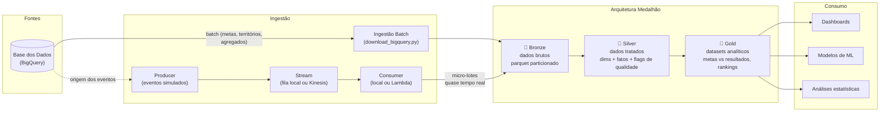

# Tech Challenge FIAP — Fase 2

## Pipeline Híbrido para Análise da Alfabetização no Brasil

Pipeline de engenharia de dados em Arquitetura Medalhão (Bronze → Silver → Gold) com ingestão híbrida (batch + streaming), construído sobre dados públicos do INEP disponibilizados pela [Base dos Dados](https://basedosdados.org/), para acompanhar o **Indicador Criança Alfabetizada** no Brasil.

---

## 1. Contexto do Problema

A alfabetização na infância é um dos pilares do desenvolvimento educacional, social e econômico de um país. O **Compromisso Nacional Criança Alfabetizada** é a política pública que mobiliza União, estados, Distrito Federal e municípios com o objetivo de garantir que todas as crianças brasileiras estejam alfabetizadas até o final do 2º ano do Ensino Fundamental.

Para dar base objetiva a essa política, o INEP realizou em 2023 a **Pesquisa Alfabetiza Brasil**, que definiu o ponto de corte de **743 pontos na escala de proficiência do Saeb** como o nível a partir do qual uma criança é considerada alfabetizada. Desse parâmetro nasceu o **Indicador Criança Alfabetizada**: o percentual de estudantes que atingem esse patamar. A meta nacional é que, até **2030**, 100% das crianças estejam alfabetizadas ao final do 2º ano.

O desafio analítico: acompanhar esse indicador exige integrar fontes heterogêneas — metas nacionais, estaduais e municipais, dados territoriais e microdados de avaliação por aluno — com qualidade, escalabilidade e custo controlado. Este projeto simula o trabalho de um time de engenharia de dados de uma organização pública de análise educacional que constrói exatamente essa fundação.

### Perguntas de negócio que a pipeline responde

- Qual a taxa de alfabetização observada por Brasil, UF e município, e como ela se compara com as metas oficiais de cada ano?
- Quais UFs e municípios estão mais distantes das metas e deveriam ser priorizados por políticas públicas?
- Como o indicador evolui no tempo, em cada nível de agregação?

---

## 2. Arquitetura da Solução

### Visão geral



### Fluxo de dados

1. **Extração batch**: `src/bronze/download_bigquery.py` consulta a Base dos Dados no BigQuery (com dry run de custo antes de cada execução) e grava as 7 entidades em parquet, particionadas por `execution_date`.
2. **Ingestão streaming**: `src/streaming/producer.py` reemite medições de alunos como eventos em micro-lotes — para a fila local (modo padrão, sem AWS) ou para o Kinesis Data Streams (`--destino kinesis`). O consumo é feito pelo `consumer.py` (local) ou pelo Lambda `consumer_lambda.py` (nuvem), que adicionam metadados de ingestão e gravam na Bronze particionado por ano.
3. **Consolidação Bronze**: `src/bronze/processar_bronze.py` unifica os arquivos brutos de cada entidade com metadados técnicos (`entidade_origem`, `modo_ingestao`, `data_ingestao_bronze`).
4. **Transformação Silver**: `src/silver/processar_silver.py` limpa, padroniza tipos, remove duplicidades, normaliza chaves, cria flags de qualidade e modela dimensões e fatos.
5. **Camada Gold**: `src/gold/processar_gold.py` integra resultados e metas e materializa datasets prontos para consumo analítico.

`main.py` executa as três etapas acima em sequência (bronze → silver → gold) com um único comando.

### Implementação em nuvem (AWS)

A pipeline de streaming e o data lake estão **implementados e testados na AWS** (região `sa-east-1` — dados públicos brasileiros em região brasileira):

| Componente local (simulação) | Implementação AWS | Status |
|---|---|---|
| `data/` (parquet em camadas) | S3 — prefixos `bronze/`, `silver/`, `gold/` no bucket do lake | ✅ implantado (63+ arquivos) |
| `data/streaming/fila/` (micro-lotes JSON) | Kinesis Data Streams (1 shard provisionado) | ✅ implantado |
| `src/streaming/consumer.py` | Lambda `consumer_lambda.py` com trigger no Kinesis + layer AWSSDKPandas | ✅ implantado |
| Prints/logs de execução | CloudWatch Logs (lotes processados por invocação) | ✅ ativo |
| `src/bronze/download_bigquery.py` | Glue Job Python Shell `bronze-ingestao` (BigQuery → S3, service account no Secrets Manager) dentro do Glue Workflow, disparado por EventBridge Scheduler | ✅ implantado |
| `src/silver` e `src/gold` | Glue Jobs plugáveis no mesmo workflow (encadeamento condicional já provisionado; `pipeline_jobs` hoje só lista `bronze_ingestao`) | 🔜 transformações prontas localmente, ainda não plugadas no workflow |
| — | Alertas de falha de job: EventBridge rule → SNS (e-mail) | ✅ implantado |

O desenho local e o da nuvem são deliberadamente espelhados: o handler do Lambda (`src/streaming/consumer_lambda.py`) reimplementa o mesmo fluxo do consumer local, e o producer alterna entre os destinos com uma flag (`--destino kinesis` usa `put_records` via boto3). Isso permite que qualquer avaliador execute a simulação completa sem conta AWS, e que a versão em nuvem seja reproduzida com um comando via Terraform (`infra/` — ver [infra/README.md](infra/README.md)), incluindo o import dos recursos pré-existentes para o state.

Teste de ponta a ponta realizado: 500 eventos reais de alunos enviados pelo producer → Kinesis → Lambda (5 lotes de 100) → parquet particionado por ano no S3. Evidências (prints do console S3, métricas do Kinesis e logs do CloudWatch) em [docs/evidencias/](docs/evidencias/).

---

## 3. Ingestão Híbrida — por que cada fonte é batch ou streaming

| Fonte | Modo | Justificativa |
|---|---|---|
| Metas Brasil / UF / Município | **Batch** | Publicadas em ciclos oficiais anuais; não há ganho em processá-las continuamente |
| Município, UF (agregados) | **Batch** | Dados territoriais e agregados consolidados por ano de avaliação |
| Medições de alunos | **Streaming (simulado)** | Representa o cenário real de resultados de avaliação chegando incrementalmente de escolas/sistemas aplicadores. Não existe fonte pública de streaming para esses dados, então o producer simula esse comportamento em micro-lotes — o que basta para demonstrar o padrão arquitetural |

A decisão segue o princípio de usar streaming apenas onde a semântica do dado é de evento incremental — e não "porque foi pedido". O custo operacional de um stream só se justifica para a fonte que de fato se comportaria assim em produção.

---

## 4. Arquitetura Medalhão

### 🥉 Bronze — dados brutos

- 7 entidades: `alunos` (3,87 mi de linhas), `municipio`, `uf`, `meta_alfabetizacao_brasil`, `meta_alfabetizacao_uf`, `meta_alfabetizacao_municipio`, `bolsa_familia_municipio`
- Armazenamento sem transformações significativas, histórico preservado por partição `execution_date=YYYY-MM-DD`
- Eventos de streaming gravados em `alunos_streaming/ano=YYYY/`
- Metadados técnicos de rastreabilidade em todas as entidades

**Volume de dados**: o projeto trabalha com todo o histórico disponível do Indicador Criança Alfabetizada (avaliação SAEB de 2023 e 2024 em todas as granularidades; Brasil e UF já têm um ciclo de acompanhamento adicional para 2025; metas projetadas até 2030). Indicador exige série histórica para comparação — descartar anos inviabilizaria a análise de evolução temporal.

### 🥈 Silver — dados tratados

16 tabelas modeladas em dimensões e fatos ([dicionário completo](docs/dicionario_dados_silver.md)):

- **Dimensões**: `dim_uf`, `dim_municipio`, `dim_escola`
- **Fatos de resultado**: `fato_resultado_brasil`, `fato_resultado_uf`, `fato_resultado_municipio`, `fato_resultado_meta_uf`, `fato_resultado_meta_municipio`
- **Fatos de metas** (colunas → linhas): `fato_meta_anual_brasil`, `fato_meta_anual_uf`, `fato_meta_anual_municipio`
- **Distribuição por nível**: `fato_distribuicao_nivel_uf`, `fato_distribuicao_nivel_municipio`
- **Granularidade aluno**: `fato_aluno_alfabetizacao` (3,87 mi de linhas com flags de qualidade)
- **Enriquecimento externo**: `fato_bolsa_familia_municipio` (total de beneficiários e valor pago por município/ano, ainda não consumida na Gold)

Transformações aplicadas: padronização de textos e códigos identificadores, conversão de tipos, remoção de duplicidades exatas, normalização de chaves, unpivot de metas anuais e níveis de proficiência, flags de validação (percentuais em [0,100], chaves preenchidas, valores não negativos) — registros inválidos são sinalizados, não descartados, preservando rastreabilidade.

### 🥇 Gold — camada analítica

7 datasets prontos para consumo ([dicionário completo](docs/dicionario_dados_gold.md)):

| Tabela | Pergunta que responde |
|---|---|
| `indicador_meta_brasil` / `_uf` / `_municipio` | Resultado observado vs. meta do mesmo ano, com status de atingimento |
| `evolucao_alfabetizacao` | Evolução temporal do indicador por nível de agregação |
| `ranking_uf_prioritaria` / `ranking_municipio_prioritario` | Priorização por distância à meta — insumo direto para política pública |
| `resumo_status_meta` | Consolidação de atingimento por ano e agregação |

---

## 5. Qualidade de Dados

Mecanismos implementados ao longo das camadas:

- **Duplicidade**: análise de chaves candidatas na Bronze ([insumos de modelagem](docs/insumos_modelagem_bronze.md)) e `drop_duplicates` sistemático na Silver
- **Valores ausentes**: perfil de nulos por coluna documentado nos dicionários; nulos legítimos (ex.: proficiência de alunos ausentes) preservados e sinalizados
- **Chaves de relacionamento**: validação de integridade referencial entre tabelas (cobertura de `id_municipio`, `sigla_uf`, `ano` entre origens — documentada nos insumos de modelagem)
- **Consistência**: flags de validação de intervalo em todos os campos percentuais; notebooks de quality checks (`03_quality_checks.ipynb`)

### Validadores visuais das camadas (`app/`)

Aplicações Flask para inspecionar os arquivos parquet gerados em cada camada pelo navegador — úteis para conferência rápida de qualidade sem abrir notebooks:

- `app/medallion_validator.py`: navegação entre Bronze, Silver e Gold em uma única interface (lista tabelas, resume linhas/colunas, agrupa por eixo e métrica, gera gráfico de barras, consulta a distribuição de `status_meta` e mostra amostras)
- `app/dashboard_alfabetizacao.py`: dashboard analítico da Gold (Brasil/UF/Município) com filtros de ano, rede e UF
- `app/mapa_brasil_metas.py`: mapa do Brasil (SVG) colorido por status da meta, com drill-down por estado e por município

```bash
python app/medallion_validator.py       # http://127.0.0.1:5000
python app/dashboard_alfabetizacao.py   # http://127.0.0.1:5003
python app/mapa_brasil_metas.py         # http://127.0.0.1:5004
```

---

## 6. Decisões Arquiteturais (trade-offs)

**Batch vs. Streaming** — Kafka foi considerado e descartado: para o volume do projeto (milhares de eventos, não milhões/dia), operar um cluster Kafka é over-engineering. A simulação local com fila de micro-lotes demonstra o padrão e migra naturalmente para Kinesis Data Streams (gerenciado, 1 shard, custo próximo de zero no nosso volume), mantendo a semântica de producer/consumer.

**Data Lake vs. Data Warehouse** — optamos por data lake em parquet: os dados são públicos, o consumo é analítico e exploratório, e parquet colunar + particionamento entrega performance de leitura sem o custo fixo de um warehouse provisionado. Se o consumo evoluir para BI corporativo de alta concorrência, a Gold pode ser publicada em um warehouse (Athena/Redshift Spectrum leem o mesmo parquet no S3 sem migração).

**Custo vs. Performance** — o pipeline prioriza custo: processamento em micro-lotes em vez de streaming contínuo provisionado, transformações em pandas (suficiente para 3,9 mi de linhas; Spark seria justificável apenas acima de dezenas de milhões), armazenamento colunar comprimido. A performance de consulta é garantida pelo particionamento, não por computação cara.

---

## 7. Monitoramento e FinOps

### Monitoramento

- **Local**: logs estruturados de execução em todas as etapas (entidade processada, volumetria, arquivos gerados), contagem de lotes/eventos no streaming, validações com relatório de aprovação/reprovação
- **Nuvem (ativo)**: CloudWatch Logs registra cada invocação do Lambda consumer (eventos processados, arquivos gravados); as métricas do Kinesis (`IncomingRecords`, `GetRecords.IteratorAgeMilliseconds`) medem volume e latência do stream; o trigger expõe `LastProcessingResult` para diagnóstico de falhas de ingestão
- Evolução: alarmes CloudWatch + SNS para notificação ativa de falhas

### FinOps

Decisões que reduzem custo operacional:

- **Parquet + particionamento** (`execution_date`, `ano`): leitura seletiva de partições reduz bytes escaneados — em Athena/BigQuery, custo é proporcional a bytes lidos
- **Dry run obrigatório antes da extração**: `download_bigquery.py` estima os bytes de cada consulta antes de executar e impõe `maximum_bytes_billed` como trava de custo (a extração completa processa ~260 MB, dentro do free tier de 1 TB/mês do BigQuery — custo real: R$ 0)
- **Cache de resultados**: re-execuções não repetem consultas (arquivos existentes são pulados)
- **Serverless por padrão**: Lambda e Kinesis cobram por uso; não há cluster ocioso. A janela de batching de 5s no trigger agrupa eventos e reduz invocações do Lambda
- **Custo real medido da arquitetura AWS no nosso volume**: S3 (~150 MB) + Kinesis (1 shard provisionado, ~US$ 0,02/h) + Lambda (invocações esporádicas no free tier) ≈ **menos de US$ 5/mês** — e o Terraform permite subir a infra só quando necessário e derrubar depois (`terraform destroy`, ou destroy direcionado do Kinesis, o único custo fixo relevante), zerando o custo ocioso. Os jobs Glue rodam em Python Shell (1 DPU), a fração de centavo por execução

---

## 8. Aplicação em IA

A camada Gold foi desenhada para alimentar diretamente casos de uso de inteligência artificial:

- **Modelos de predição de alfabetização**: `fato_aluno_alfabetizacao` (Silver) fornece 3,87 mi de observações com proficiência, presença, rede e território — base para prever risco de não-alfabetização por município/escola. Enriquecida com fontes externas (Censo Escolar, indicadores socioeconômicos do IBGE), suporta modelos de regressão/classificação com features contextuais
- **Análise de desigualdade educacional**: as distribuições por nível de proficiência (`fato_distribuicao_nivel_*`) permitem medir dispersão intra-UF e clusters de vulnerabilidade educacional (ex.: k-means sobre distância à meta + nível socioeconômico)
- **Políticas públicas baseadas em dados**: os rankings de priorização da Gold são o insumo direto para alocação de recursos do Compromisso Nacional — a evolução temporal permite avaliar efeito de intervenções (diferença-em-diferenças entre municípios priorizados e não priorizados)

---

## 9. Tecnologias Utilizadas

| Tecnologia | Uso | Justificativa |
|---|---|---|
| Python 3.12 + pandas + pyarrow | Todo o pipeline | Stack padrão de dados; volume do projeto não justifica engine distribuída |
| Parquet | Armazenamento em todas as camadas | Colunar, comprimido, schema embutido; leitura seletiva de colunas/partições |
| BigQuery (Base dos Dados) | Fonte dos dados públicos | Dados INEP já estruturados e versionados; SQL padrão; free tier cobre o projeto |
| Jupyter Notebooks | Exploração e entendimento dos dados | Documentação executável — código, resultado e decisão no mesmo artefato; transformações Silver/Gold em produção rodam via `src/silver` e `src/gold` |
| Flask | Validadores visuais das camadas (`app/`) | Inspeção rápida dos parquets pelo navegador, sem depender de notebook |
| Git + GitHub (branches + PRs) | Versionamento e colaboração | Evolução rastreável do pipeline por feature branches e Pull Requests |
| AWS (S3, Kinesis, Lambda, Glue, EventBridge, SNS) | Data lake, streaming e pipeline batch em nuvem | Serverless, pay-per-use, aderente ao volume do projeto (ver seção FinOps) |
| Terraform | IaC de toda a infra AWS (`infra/`) | Infraestrutura reproduzível com um comando; recursos pré-existentes importados via `import` blocks |

---

## 10. Estrutura do Repositório

```text
.
├── app/                           # validadores/dashboards Flask (inspeção via navegador)
├── data/                          # data lake local (não versionado)
│   ├── bronze/                    #   brutos por entidade + partições execution_date
│   ├── silver/                    #   tabelas tratadas particionadas
│   ├── gold/                      #   datasets analíticos
│   └── streaming/                 #   fila de micro-lotes (simulação do stream)
├── docs/
│   ├── crisp_dm.md                # abordagem CRISP-DM do projeto
│   ├── dicionario_dados_bronze.md # perfil técnico das tabelas Bronze
│   ├── dicionario_dados_silver.md # dicionário das tabelas Silver
│   ├── dicionario_dados_gold.md   # dicionário das 7 tabelas Gold
│   ├── evidencias/                # prints da execução em nuvem (S3, Kinesis, Lambda)
│   └── insumos_modelagem_bronze.md# chaves, relacionamentos e backlog
├── infra/                         # IaC Terraform de toda a infra AWS
│   ├── *.tf                       #   S3, Kinesis, Lambda, Glue, Scheduler, SNS
│   └── README.md                  #   apply, secret GCP, como plugar silver/gold
├── notebooks/
│   ├── 01_download_bronze_bigquery.ipynb    # espelha src/bronze/download_bigquery.py
│   ├── 01_entendimento_dados_bronze.ipynb
│   ├── 02_silver_transformacoes.ipynb       # exploração; a Silver "de verdade" roda via src/silver
│   ├── 03_quality_checks.ipynb
│   └── 04_gold_analitica.ipynb              # exploração; a Gold "de verdade" roda via src/gold
├── queries/bronze/                # SQL de extração (Base dos Dados)
├── src/
│   ├── aws/                       # upload do data lake para o S3
│   ├── bronze/                    # ingestão batch (leitura, gravação, download BigQuery)
│   ├── silver/                    # transformações Bronze -> Silver (dims, fatos, flags de qualidade)
│   ├── gold/                      # agregações Silver -> Gold (indicadores, rankings, evolução)
│   ├── glue/                      # scripts dos jobs Glue (ingestão bronze na nuvem)
│   └── streaming/                 # producer, consumer local e consumer Lambda
├── main.py                        # pipeline completo: bronze -> silver -> gold
├── requirements.txt
└── .env.example
```

---

## 11. Como Executar

### Pré-requisitos

- Python 3.12+
- Conta Google Cloud com um projeto criado (só para a extração; free tier suficiente)

### Setup

```bash
# 1. Ambiente virtual
python -m venv .venv
.venv\Scripts\Activate.ps1        # Windows | source .venv/bin/activate (Linux/Mac)

# 2. Dependências
pip install -r requirements.txt

# 3. Variáveis de ambiente
copy .env.example .env            # e preencha GCP_PROJECT_ID
```

### Pipeline batch

```bash
# 4. Extração da Base dos Dados (abre o navegador para login Google)
python -m src.bronze.download_bigquery              # use --somente-dry-run para só estimar custo

# 5. Pipeline completo: Bronze -> Silver -> Gold
python main.py
```

Os notebooks `02_silver_transformacoes.ipynb` e `04_gold_analitica.ipynb` continuam no repositório para exploração/depuração passo a passo, mas não são mais o caminho de execução — `main.py` já roda as três camadas via `src/silver` e `src/gold`.

### Pipeline streaming — simulação local (dois terminais, sem AWS)

```bash
# Terminal 1 — consumer (inicie primeiro)
python -m src.streaming.consumer

# Terminal 2 — producer
python -m src.streaming.producer --total-eventos 1000 --tamanho-lote 100
```

O consumer encerra sozinho após ciclos consecutivos de fila vazia (configurável via `--max-ciclos-vazios`).

### Pipeline streaming — AWS

Com a infra provisionada (ver [infra/README.md](infra/README.md)) e `AWS_REGION`/`KINESIS_STREAM_NAME` no `.env`:

```bash
# Envia eventos reais ao Kinesis; o Lambda consome e grava no S3 automaticamente
python -m src.streaming.producer --destino kinesis --total-eventos 500

# Acompanhar o processamento
aws logs tail /aws/lambda/fiap-alfabetizacao-consumer --follow
```

### Upload do data lake para o S3

```bash
python -m src.aws.upload_s3 --dry-run    # lista o que seria enviado
python -m src.aws.upload_s3              # sobe bronze, silver e gold
```

### Pipeline batch — AWS (Glue Workflow)

Com o secret da service account GCP carregado (ver [infra/README.md](infra/README.md)):

```bash
# Dispara a ingestão bronze na nuvem (BigQuery -> S3); silver e gold
# entram no mesmo workflow quando as transformações forem plugadas
aws glue start-workflow-run --name fiap-alfabetizacao-pipeline
```

---

## 12. Metodologia

O projeto segue a abordagem **CRISP-DM** (entendimento do negócio → entendimento dos dados → preparação → modelagem → avaliação → implantação), documentada em [docs/crisp_dm.md](docs/crisp_dm.md). Os artefatos de entendimento e qualidade de cada etapa estão em `docs/`.

---

## 13. Próximos Passos

- [x] Provisionamento AWS via IaC (Terraform: S3 + Kinesis + Lambda + Glue + EventBridge + SNS) com evidências de execução
- [x] Monitoramento com CloudWatch (logs e métricas do stream/Lambda/Glue)
- [x] Alertas de falha de job Glue via EventBridge + SNS (e-mail)
- [x] Ingestão batch na nuvem (Glue Job `bronze-ingestao` + Glue Workflow + Scheduler)
- [x] Carregar a service account GCP no Secrets Manager e habilitar o agendamento
- [ ] Plugar Silver (`src/silver`) e Gold (`src/gold`) como Glue Jobs no workflow (hoje `pipeline_jobs` só lista `bronze_ingestao`; local já roda as três camadas via `main.py`)
- [ ] Atualização do notebook de quality checks para a estrutura atual da Silver
- [ ] Enriquecimento com fontes externas (Censo Escolar, IBGE) para os casos de uso de IA
- [ ] Vídeo executivo (até 5 min)
